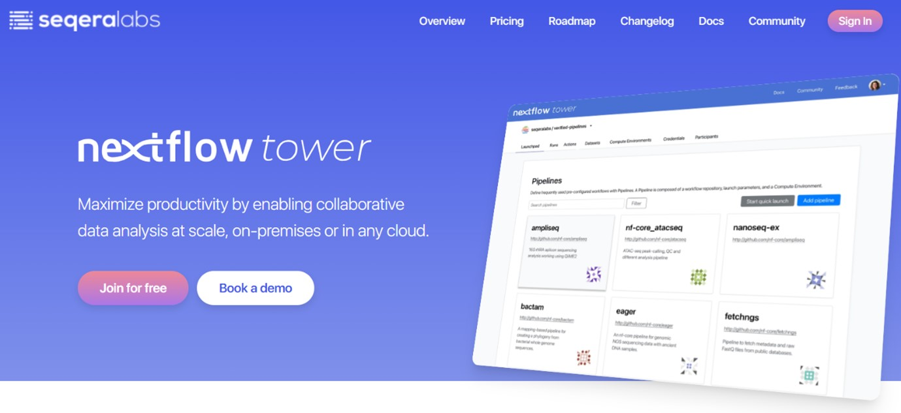
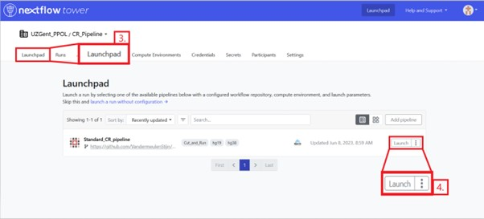
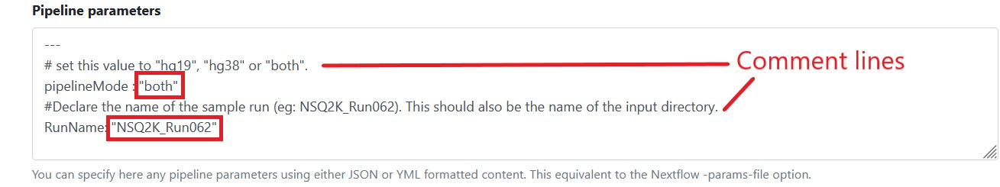
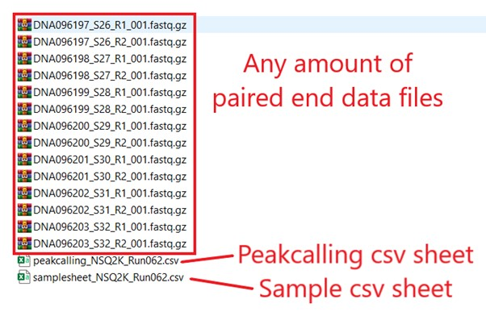
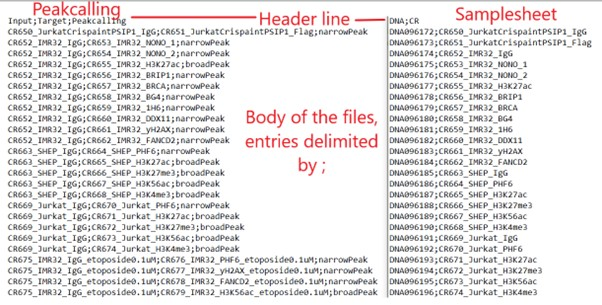
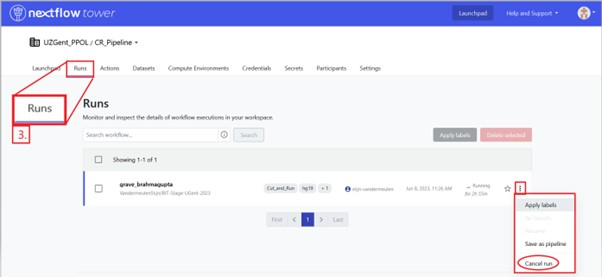
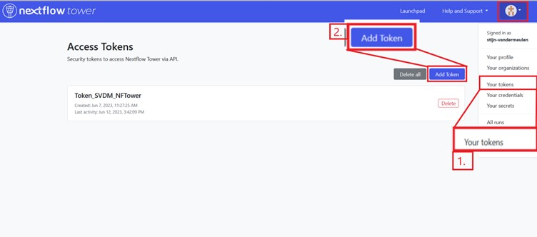
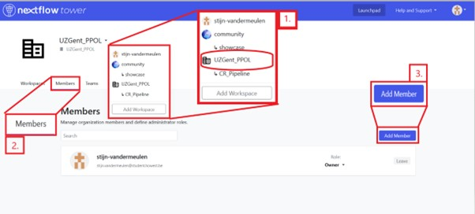
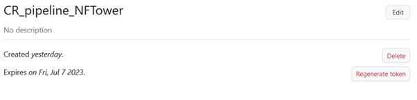

# For users
## First time setup
1. Go to [Tower.nf](https://tower.nf/)  

2. Log in via GitHub, Google or a custom email address
3. Request access to the UZGent PPOL group by sending either your username or the corresponding email address to the PPOL group administrator.

## Launching the pipeline
1. Go to the PPOL group
2. Go to the CR_Pipeline workspace  

3. Go to the **Launchpad** tab
4. Click the **Launch** button on the pipeline listed in the center of the page, this will open a launch form  

5. Give it a custom workflow run name if you want to
6. Scroll down to pipeline parameters  

7. Update and confirm that these are the desired parameters
8. Confirm that the inputfolder contains the **sample pairs** , the **samplesheet** and the **peakcallingsheet**  
  

9.  Click **Launch** on the bottom right of the form

## Monitoring a run
1. Go to the PPOL group
2. Go to the CR_Pipeline workspace
3. Go to the **Runs** tab
Here you can choose any stored or active run to review it's current status, memory or cpu usage as well as the output logs. You can also cancel active runs here.  


# For administrators
## Tower access token
1.	Go to your tokens
2.	Click **add token**
3.	Give it a name
4.	Copy the token displayed on your screen, once you close this window you will not be able to view it again  


## Adding a user to the PPOL group
1.	Go to the PPOL group
2.	Go to the Members tab
3.	Click **add member**
4.	Fill in the members username or the email address they signed in with
5.	Click **add**  

6.  go to the CR_pipeline workspace
7.  go to the **participants** tab
8.  Add the user here to grant them access to the pipelines in the workspace

## Configuring the credentials for a workspace
1.	Go to the group workspace
2.	Go to the Credentials tab
3.	Click the add credentials button
4.	Give it a name
5.	Select what type of credentials (you will need at least credentials for Tower agent. You will need credentials for GitHub if you intend to use a private GitHub repository to store the pipeline and it’s config file.)

### Tower agent – Required for HPC to tower.nf connection - Continue from configuring the credentials for a workspace
1.	Enable shared agent
2.	Note down the agent connection id (the tower agent on the HPC has to launch using this id to allow for a successful connection. As described in the ‘usage’ box below it, copied here for convenience.)
```
Exports your personal token
export TOWER_ACCESS_TOKEN=<YOUR TOKEN> 
Downloads the tower agent into the current repository
curl -fSL https://github.com/seqeralabs/tower-agent/releases/latest/download/tw-agent-linux-x86_64 > tw-agent 
grants it execution permissions
chmod +x tw-agent 
Runs the agent in the current directory and designates the work directory at the specified path. This working directory is where all the temporary working directories belonging to the nextflow pipeline will be placed, fill in the Agent_connection_ID here.
./tw-agent <Agent_connection_ID> --work-dir=./work
```
### GitHub credentials – only required if the repository is private - Continue from configuring the credentials for a workspace
#### Getting a GitHub PAT
1.	Go to your GitHub
2.	Go to your “Settings” 
3.	Go to “Developer settings” in the list on the left side
4.	Under “personal access tokens” choose “Fine-grained tokens”
5.	Click “generate token” on the right side  

6.	Give it a name
7.	Declare it’s expiration date
(fine grained tokens need to have one so remember to replace it when the time comes, don’t forget to update the token credentials in nextflow Tower!)
8.	Choose “only select repositories” and choose the Pipeline where the repository is stored
9.	Under “Repository permissions” grant “read only” to the following categories:
    - Actions
    - Administration
    - Contents
    - Deployments	
    - Metadata
    - Pages
10.	 Under “account permissions” enable “interaction limits” with “read only”
11.	 Hit generate
> Copy the token because once you leave this page you will no longer be able to view it. (If you lose this token you will have to generate a new one, which you can do by selecting the existing token and clicking “regenerate token”)  
> 

1.	Enter the GitHub username of the repository owner
2.	Acquire a PAT (personal access token) from GitHub and paste this here
(Details below)
3.	Enter the URL of the repository (this has to be the base/first level directory)
4.	Click “add”
