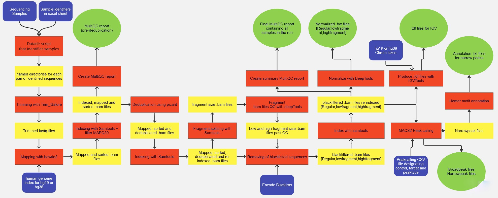

# CUT&RUN Nextflow Pipeline using Apptainer as a Container 

## Building an Apptainer Container

To create your Apptainer container from the definition file (Singularity.def), follow these steps on the UGent HPC system:

1. Navigate to your scratch directory. The HPC environment only allows container builds in the scratch space:

```r
cd $VSC_SCRATCH
```

2. Place the Singularity.def file in this location. You can create a dedicated subfolder (e.g., Apptainer) to keep things organized:

```r
mkdir -p Apptainer
cd Apptainer
```

3. Build the container. Run the following command to build your container:

```r
apptainer build CR_Nextflow_Pipeline_v1.2.sif Singularity.def
```
This will generate the file CR_Nextflow_Pipeline_v1.2.sif in your $VSC_SCRATCH/Apptainer directory.


## Scripts CUT&RUN

- **C&R_pipeline.nf** : This is the effective pipeline containing the next steps:
- **Launch_C&R_pipeline.sh** : A very simple shell script that launches the pipeline using the SLURM SBATCH-method. 
- **README.md** : A different README file with a quick start guide for basic manual usage of the pipeline. 
- **nextflow.config** : The config file containing the necessary parameters for the pipeline to function, usually you will have to adapt this one to some extent.

## Using the pipeline

Making use of the Cut and Run pipeline requires 3 inputs and some minor setup.

**The inputs:** 
- The fastq archives with name-format DNAXXX\_ where XXX is any amount of numbers followed by an underscore. e.g.:
> DNA096174_S3_R1_001.fastq.gz  
> DNA096174_S3_R2_001.fastq.gz

These should always come in pairs where the R1 and R2 are the differentiating element.

- A samplesheet file in samplesheet_[RunName].csv format using semicolons (';') as delimiters. This file should countain two columns and the exact header shown below: 
1. first column = DNA name of the file 
2. second column = CR name of the file the pipeline will identify the filepairs based on the DNA name and transform these into the CR names.  
  Example of file below:

> DNA;CR  
> DNA096174;CR652_IMR32_IgG  
> DNA096179;CR657_IMR32_BRCA  
> DNA096203;CR681_IMR32_H3K4me3_etoposide0.1uM

- A peakcalling file in peakcalling_[RunName].csv format delimited by semicolons (';') and use the headers as shown below. This file should countain three columns: 
1. first column = the CR name of the control sample 
2. second column = the CR name of the target sample 
3. third column = the type of peakcalling that needs to be performed

> Input;Target;Peakcalling  
> CR652_IMR32_IgG;CR657_IMR32_BRCA;narrowPeak  
> CR652_IMR32_IgG;CR681_IMR32_H3K4me3_etoposide0.1uM;broadPeak

*Note that the peakcalling can only be performed on samples that are a part of the pipeline input.*
*Declaring an old control or target that isn't currently running through the pipeline will break it.*

**The configuration:**
- Some modifications to the **nextflow.config** file will be required:
  
1. Edit the container path under the ```PROCESS CONFIGURATIE```

     
  > container = "/scratch/gent/436/vsc43612/Apptainer/CR_Nextflow_Pipeline_v1.2.sif"
   
2. Updating/confirming the input path, data path, results path, pipelineMode and links to all reference genomes in the ```MAIN PARAMETERS``` section

- Open the **Launch_CR_pipeline.sh** script and change the pathways for the WORKFLOW and CONFIG variables to match those of of the pipeline.nf file and .config file.

***The pipeline is not clever enough to handle typo's. Check for spelling mistakes and capitalization.***

## Running the pipeline:

The standard launch is performed using the following command with < RunName > being the name of the input directory and < pipelineMode > set to hg19/hg38/both:
```
sbatch Launch_CR_pipeline.sh < RunName > < pipelineMode >  -with-apptainer
```
This will submit it to the SLURM job management system with the #SBATCH parameters at the top of the shell file.  
If your HPC does not use SLURM you will probably have to adjust the parameters to match those of your particular job management system. The pipeline itself also submits each of it's processes via SLURM but changing this only requires the 'executor' parameter (found in the process section) to be updated in the config file.  
The nextflow documentation has a list of all compatible systems: https://www.nextflow.io/docs/latest/executor.html  

Nextflow caches it's runs and allows users to resume from the last set of succesful processes using the '-resume' function. The launch script is compatible with this feature.
```
sbatch Launch_CR_pipeline.sh < RunName > < pipelineMode >  -with-apptainer -resume 
```
*note: The launch script currently requests 24 hours of walltime. Depending on the amount of samples you're processing and the speed at which your HPC handles them you may need to adjust the walltime.*

# Understanding the pipeline 

## The workflow

These lines define the 4 original inputs by creating channels using the fromPath type (Paths = files).
```
  def filepairs = Channel.fromFilePairs("$params.inputDir/*{R1,R2}*.fastq.gz", checkIfExists:true) 
  def SampleTuple = Channel.fromPath(params.SampleSheet, checkIfExists:true) | splitCsv(header: true, strip: true ,sep:';') | map { row-> tuple(row.DNA, row.CR) }
  def PeakCallingSheet = Channel.fromPath(params.PeakcallingSheet, checkIfExists:true) | splitCsv(header:true, strip: true,sep:';') | map { row-> tuple(row.Input, row.Target,row.Peakcalling) }
  def runname = Channel.fromPath(inputDir)
```

The | pipe below means that every step will push all of its outputs to the following step. 
```
File_sheet_match(filepairs)    # A preprocessing step that allows the following step to function. The 'filepairs' between brackets designates what is used as input. 
| join(SampleTuple)            # This step merges the pairs of input files with their DNA id and their CR id to create a single list based off of the common id.
| MoveToDataDir                # Creates an output directory in the data directory and renames the files to the appropriate CR naming scheme. 
| TrimFiles                    # The process that takes the fastq files and runs them through Trimmomatic. 
```

A set of three steps through which the duplicate % is extracted from the multiQC process and set as a numeric variable for the individual
samples. 
```
    MapFiles(trimmedfile1,trimmedfile2,trimreport1,trimreport2,workingDir,workingDirName) # The mapping process performed upon the trimmed files.
  | MultiQC                                                                               # Takes the previous outputs, generates a multiQC report for the individual sample and extracts the duplicate percentage.
    
    MultiQC.out.Dedup_percent                                                             # Select the percentage
  | toFloat                                                                               # change it from string to float
  | merge (MultiQC.out.workingDirName) {a,b -> tuple(b,a)}                                # attach it to an id value
  | join (MapFiles.out.deduptuple)                                                        # join it to the deduplication inputs using the id to guarantee correct data-value association
  | set {Dedup_Input}                                                                     # set the output
  
    Dedup(Dedup_Input)                                                                    # conditionally run the deduplication process depending on the amount of duplicates found during multiQC
```

The SplitFragments-BlackFiltering line, both  of them using declared inputs instead of | as a connection.  
Using | causes ALL outputs to be forwarded when only a couple of the files are required when this is not always desirable.  
The blacklists for the ENCODE filtering are based off of the following publication https://doi.org/10.1038/s41598-019-45839-z and can be found here https://github.com/Boyle-Lab/Blacklist.
```
# Generates Bam subsets based on high and low sequence length. The desired length can be modified in the config file. 
SplitFragments(Dedup.out.postDedupMAPQ30BAM,Dedup.out.workingDirName,Dedup.out.dedupBAI) 
# Filters out regions that have an adverse effect on high throughput analysis using the ENCODE blacklist.
BlackFiltering(SplitFragments.out.SmallFragBAM,SplitFragments.out.LargeFragBAM,SplitFragments.out.workingDirName,Dedup.out.postDedupMAPQ30BAM,SplitFragments.out.splitFragBAI)
```

Generation of .bw and .tdf files for each of the BlackFiltering outputs (MAPQ30, low120, high120) using declared inputs.
```
RPKM_normalizing(BlackFiltering.out.BlackfilteredBAMS,BlackFiltering.out.BlackFilterBaseName,BlackFiltering.out.BlackfilteredBAIS)
IGV(BlackFiltering.out.BlackfilteredBAMS,BlackFiltering.out.BlackFilterBaseName,BlackFiltering.out.BlackfilteredBAIS)
```

Two short | connected functions that collect all of the BAMS and BAIS post blackfiltering and collects them into a single channel each.
```
BlackFiltering.out.BlackfilteredBAMS                          # Bam output files.
|  collect                                                    # A nextflow operator that waits and collects all the outputs from all the samples.
|  set{BamCollection}                                         # Declare it as a variable.
 BlackFiltering.out.BlackfilteredBAIS                         # BAI output files.
|  collect                                                    # A nextflow operator that waits and collects all the outputs from all the samples.
|  set{BaiCollection}                                         # Declare it as a variable.
    
# The peakcalling process using the two collections and the CSV PeakcallingSheet as inputs, the latter is used to pair the Bam files with their control files.
PeakCalling(BamCollection,PeakCallingSheet,BaiCollection)
```
Both homer processes using only the narrowpeak files output by the peakcalling process. Additionally a variable is passed along to correctly name the output directory.
```
Homer_findMotif(PeakCalling.out.HomerPeakFile,PeakCalling.out.peakDirName)
Homer_annotatePeaks(PeakCalling.out.HomerPeakFile,PeakCalling.out.peakDirName)
```
A very simple process that uses the name of the input directory (containing all sample and csv files) to determine the runname.
```
RunName(runname)
```
A summary MultiQC run performed on all the BAMs post blackfiltering.
```
summary_MultiQC(BamCollection,BaiCollection,RunName.out)
```


Since Nextflow is capable of asynchronous jobhandling it will submit these jobs whenever the required inputs are supplied.  
This means it can perform various tasks at the same time, as well as flexibly run multiple samples at the same time.
It can also choose to make use of both the hg19 and hg38 reference genome at the same time.


